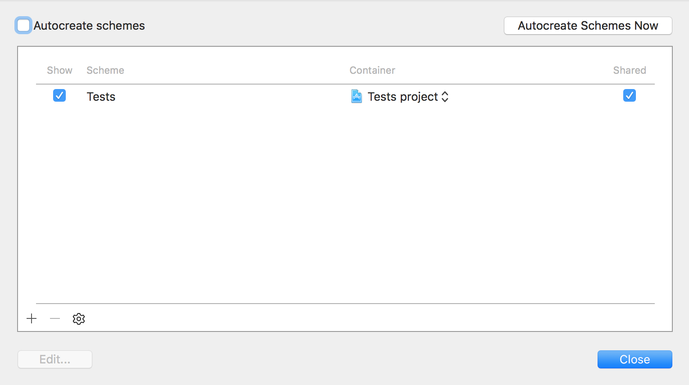

# Contributing Guidelines

Want to help out with the Swift Algorithm Club? Great! While we don't have strict templates on the format of each contribution, we do have a few guidelines that should be kept in mind:

**Readability**

Our repo is all about learning. The `README` file is the cake, and the sample code is the cherry on top. A good contribution has succinct explanations supported by diagrams. Code is best introduced in chunks, weaved into the explanations where relevant. 

> When choosing between brevity and performance, err to the side of brevity as long as the time complexity of the particular implementation is the same. You can make a note afterwards suggesting a more performant way of doing things. 

**API Design Guidelines**

A good contribution abides to the [Swift API Guidelines](https://swift.org/documentation/api-design-guidelines/). We review the pull requests with this in mind.

**Swift Language Guidelines**

We follow the following Swift [style guide](https://github.com/raywenderlich/swift-style-guide). 

## Contribution Categories

### Refinement

Unit tests. Fixes for typos. No contribution is too small. :-)

The repository has over 100 different data structures and algorithms. We're always interested in improvements to existing implementations and better explanations. Suggestions for making the code more Swift-like or to make it fit better with the standard library are most welcome.

### New Contributions

Before writing about something new, you should do 2 things:

1. Check the main page for existing implementations
2. Check the [pull requests](https://github.com/raywenderlich/swift-algorithm-club/pulls) for "claimed" topics. More info on that below. 

If what you have in mind is a new addition, please follow this process when submitting your contribution:

1. Create a pull request to "claim" an algorithm or data structure. This is to avoid having multiple people working on the same thing.
2. Use this [style guide](https://github.com/raywenderlich/swift-style-guide) for writing code (more or less).
3. Write an explanation of how the algorithm works. Include **plenty of examples** for readers to follow along. Pictures are good. Take a look at [the explanation of quicksort](../Quicksort/) to get an idea.
4. Include your name in the explanation, something like *Written by Your Name* at the end of the document. 
5. Add a playground and/or unit tests.

For the unit tests:

- Add the unit test project to `.travis.yml` so they will be run on [Travis-CI](https://travis-ci.org/raywenderlich/swift-algorithm-club). Add a line to `.travis.yml` like this:

```
- xctool test -project ./Algorithm/Tests/Tests.xcodeproj -scheme Tests
```

- Configure the Test project's scheme to run on Travis-CI:
    - Open **Product -> Scheme -> Manage Schemes...**
    - Uncheck **Autocreate schemes**
    - Check **Shared**



## Want to chat?

This isn't just a repo with a bunch of code... If you want to learn more about how an algorithm works or want to discuss better ways of solving problems, then open a [Github issue](https://github.com/raywenderlich/swift-algorithm-club/issues) and we'll talk!
