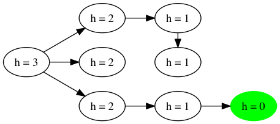
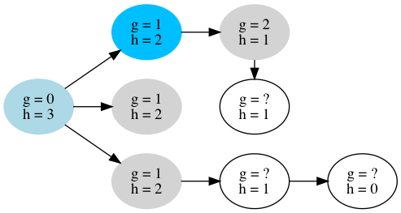
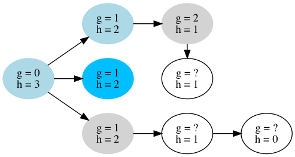
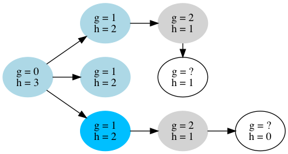
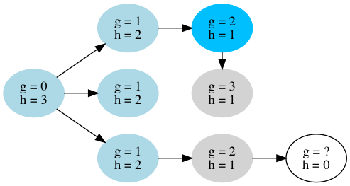
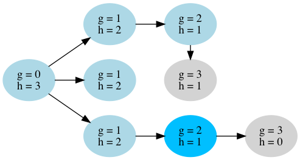
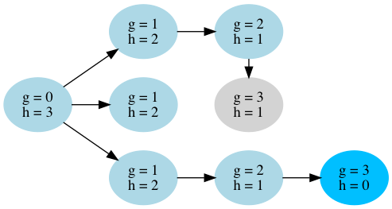

# A*

A* (pronounced "ay star") is a heuristic best-first search algorithm. A* minimizes node expansions, therefore minimizing the search time, by using a heuristic function. The heuristic function gives an estimate of the distance between two vertices. For instance if you are searching for a path between two points in a city, you can estimate the actual street distance with the straight-line distance.

A* works by expanding the most promising nodes first, according to the heuristic function. In the city example it would choose streets which go in the general direction of the target first and, only if those are dead ends, backtrack and try other streets. This speeds up search in most sitations.

A* is optimal (it always find the shortest path) if the heuristic function is admissible. A heuristic function is admissible if it never overestimates the cost of reaching the goal. In the extreme case of the heuristic function always retuning `0` A* acts exactly the same as [Dijkstra's Algorithm](../Dijkstra). The closer the heuristic function is to the actual distance the faster the search.

## Example

Let's run through an example on this simple directed graph. We are going to assume that all edges have a cost of 1 and the heuristic function is going to be the column starting at goal and going back:

On the first step we expand the root node on the left (blue). We set the cost `g` to zero and add all neighbors to the open list (grey). 

We put the first node in the closed list (light blue) so that we don't try expanding it again if there were to be loops in the graph. Next we take the node on the open list with the smallest value of `g + h` where `g` is the current cost (0) plus the edge cost (1). Since all nodes in the open list have the same value we choose the top one.

We repeat the process and pick the next node from the open list. In this case there are no new nodes to add to the open list.

We expand the next node. One more node on the open list, but nothing exciting yet.

Sicne the top and the bottom nodes have the same value we choose the top one. This is not a great choice but we could do better if we had a better heuristic function.

Now we expand the bottom node because it has a smaller value than the middle node (2 + 1 < 3 + 1).

And we finally reach the goal! We never even expanded that middle node. We didn't have to because its value is 4, which is equal to the total lenght of our solution and therefore guaranteed to not be part of the optimal solution.

The final step is to backtrack from the goal node to buld the optimal path.
