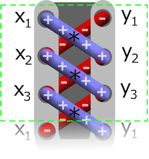
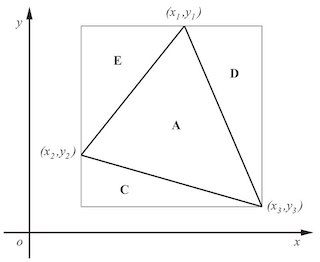
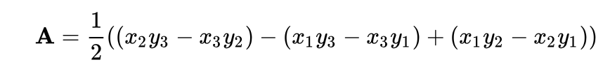
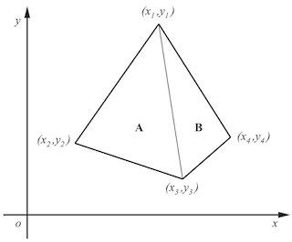
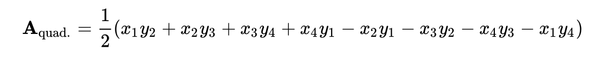
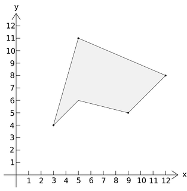
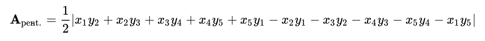

# CounterClockWise

Goal : Determine what direction to take when multiple points are given.

CounterClockWise(CCW) is based on [Shoelace formula](https://en.wikipedia.org/wiki/Shoelace_formula#Examples) by Carl Friedrich Gauss.


1. Take the first x-coordinate and multiply it by the second y-value, then take the second x-coordinate and multiply it by the third y-value, and repeat as many times until it is done for all wanted points.
2. If the points are labeled sequentially in the counterclockwise direction, then the sum of the above determinants is positive and the absolute value signs can be omitted if they are labeled in the clockwise direction, the sum of the determinants will be negative. This is because the formula can be viewed as a special case of [Green's theorem](https://en.wikipedia.org/wiki/Green%27s_theorem).




Here's an implementation in Swift that should be easy to understand:

```swift
func ccw(points: [Point]) -> Int{
  let polygon = points.count
  var orientation = 0

  for i in 0..<polygon{
    orientation += (points[i%polygon].x*points[(i+1)%polygon].y
      - points[(i+1)%polygon].x*points[i%polygon].y)
  }
    
  switch orientation {
  case Int.min..<0:
    return -1 // if operation < 0 : ClockWise
  case 0:
    return 0 // if operation == 0 : Parallel
  default:
    return 1 // if operation > 0 : CounterClockWise
  }
}
```

Put this code in a playground and test it like so:

```swift
var p1 = Point(x: 5, y: 8)
var p2 = Point(x: 9, y: 1)
var p3 = Point(x: 3, y: 6)

print(ccw(points: [p1,p2,p3])) // -1 means ClockWise
```

Here's how it works. When given an `[Photo]`, `ccw(points:)` calculates the direction of the given points according to the Shoelaces formula.


`orientation` is less than 0, the direction is clockwise. 

`orientation` is equal to 0, the direction is parallel. 

`orientation` is greater than 0, the direction is counterclockwise. 


## An example

**In Triangle**

```swift
var p1 = Point(x: 5, y: 8)
var p2 = Point(x: 9, y: 1)
var p3 = Point(x: 3, y: 6)

print(ccw(points: [p1,p2,p3])) // -1 means ClockWise
```






**In Quadrilateral**

```swift
var p4 = Point(x: 5, y: 8)
var p5 = Point(x: 2, y: 3)
var p6 = Point(x: 6, y: 1)
var p7 = Point(x: 9, y: 3)

print(ccw(points: [p4,p5,p6,p7])) // 1 means CounterClockWise
```






**In Pentagon**

```swift
var p8 = Point(x: 5, y: 11)
var p9 = Point(x: 3, y: 4)
var p10 = Point(x: 5, y: 6)
var p11 = Point(x: 9, y: 5)
var p12 = Point(x: 12, y: 8)

print(ccw(points: [p8,p9,p10,p11,p12])) // 1 means CounterClockWise
```






You probably won't need to use the CCW in any real-world problems, but it's cool to play around with geometry algorithm. The formula was described by Meister (1724-1788) in 1769 and by Gauss in 1795. It can be verified by dividing the polygon into triangles, and can be considered to be a special case of Green's theorem.


*Written for Swift Algorithm Club by TaeJoong Yoon*
