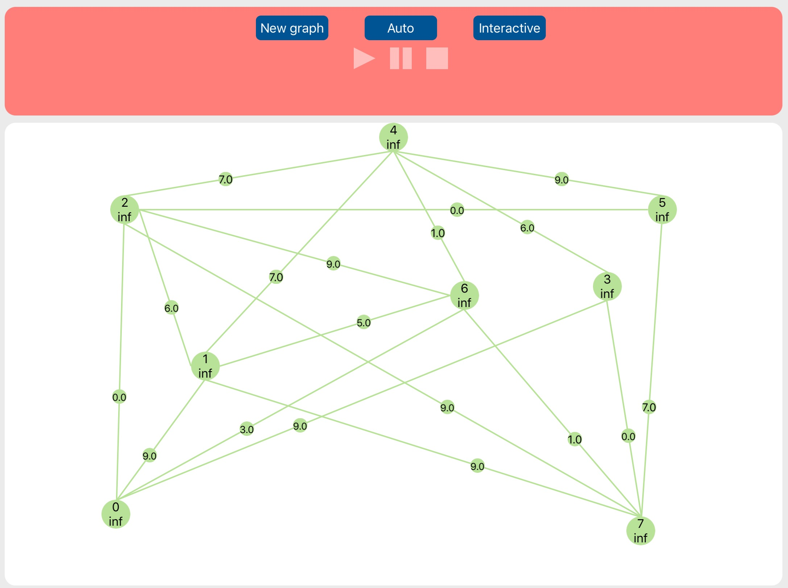
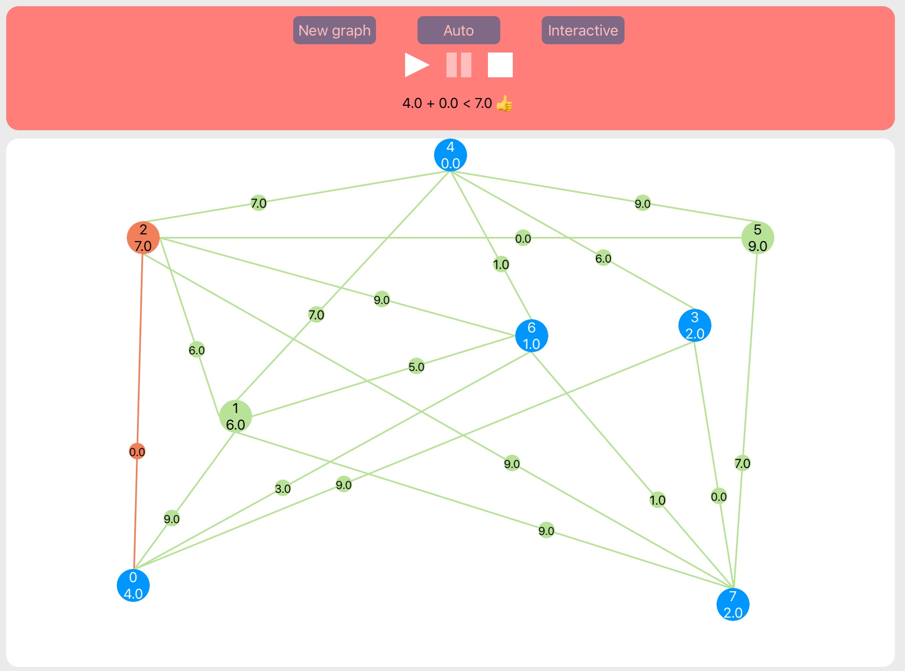
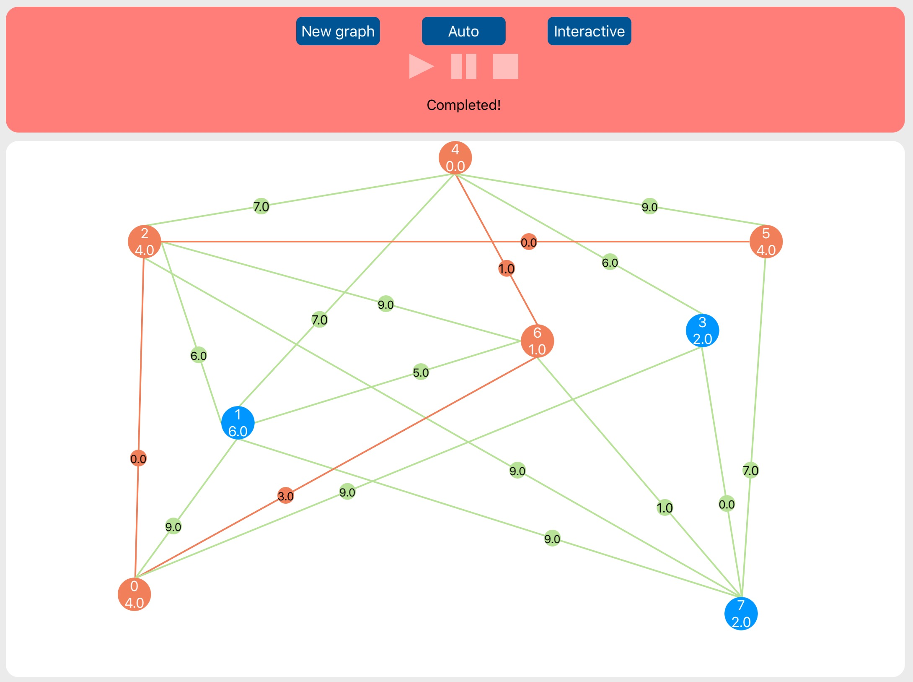

# Dijkstra-algorithm
WWDC 2017 Scholarship Project
Created by [Taras Nikulin](https://github.com/crabman448)

## About
Dijkstra's algorithm is used for finding shortest paths from start vertex in graph(with weighted vertices) to all other vertices. 
More algorithm's description can be found in playground or on wikipedia:
[Wikipedia](https://en.wikipedia.org/wiki/Dijkstra%27s_algorithm)

To understand how does this algorithm works, I have created **VisualizedDijkstra.playground.** It works in auto and interactive modes. Moreover there are play/pause/stop buttons.

If you need only realization of the algorithm without visualization then run **Dijkstra.playground.** It contains necessary classes and couple functions to create random graph for algorithm testing.

## Demo video
Click the link: [YouTube](https://youtu.be/PPESI7et0cQ)

## Screenshots

