# Weighted graph general concepts

Every weighted graph should contain:
1. Vertices/Nodes (I will use "vertex" in this readme).

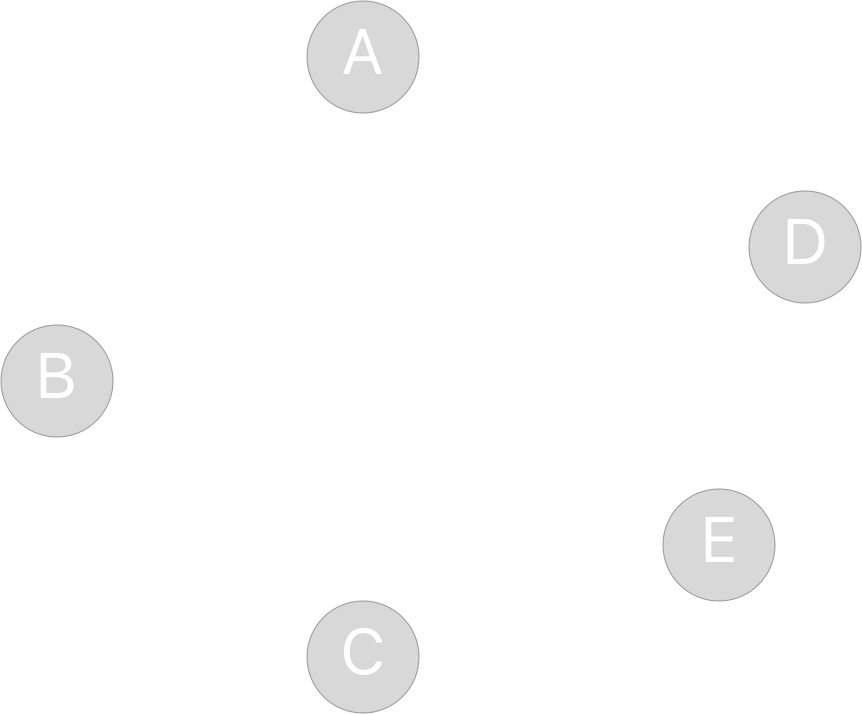

2. Edges connecting vertices. Let's add some edges to our graph. For simplicity let's create directed graph for now. Directed means that edge has a direction, i.e. vertex, where it starts and vertex, where it ends. But remember a VERY IMPORTANT thing:
    * All undirected graphs can be viewed as a directed graph.
    * A directed graph is undirected if and only if every edge is paired with an edge going in the opposite direction.

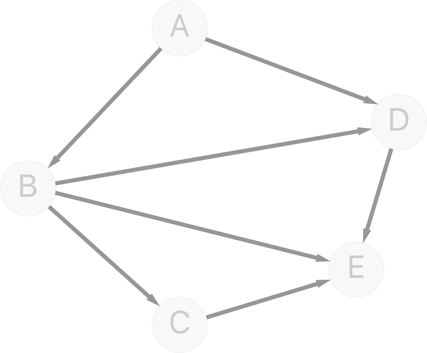

3. Weights for every edge.

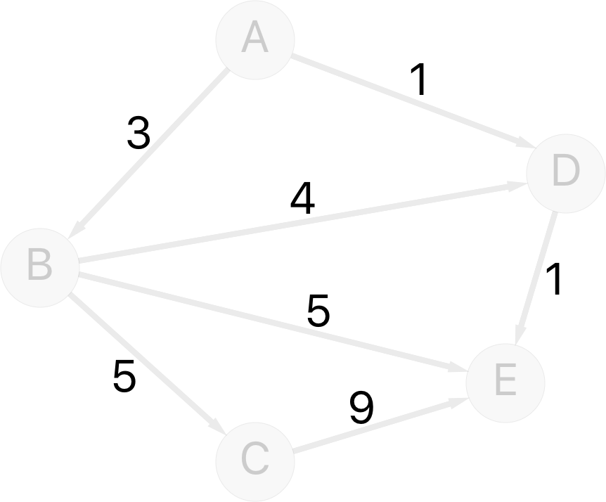

Final result.
Directed weighted graph:


Undirected weighted graph:

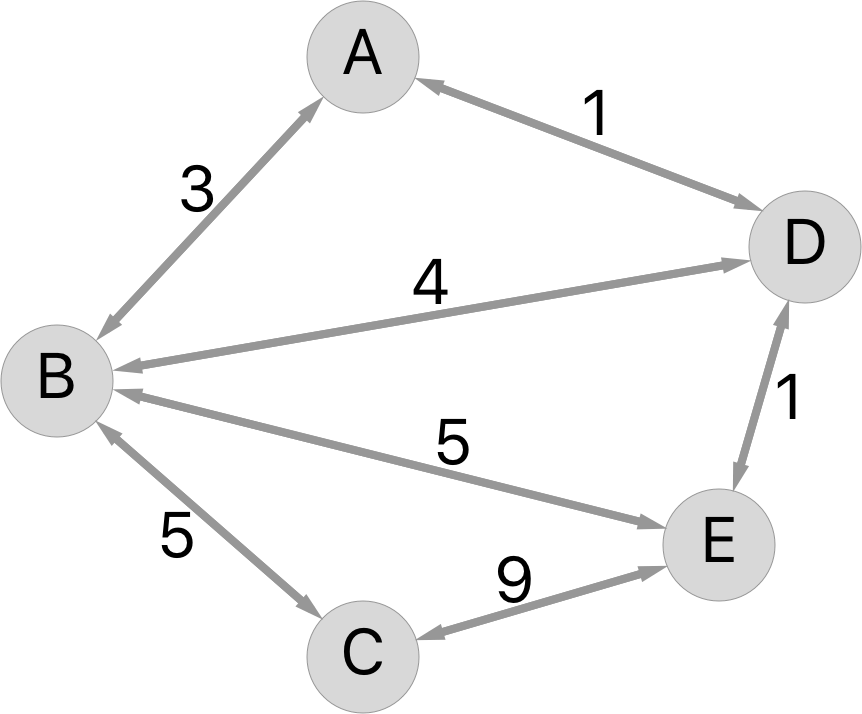

And once again: An undirected graph it is a directed graph with every edge paired with an edge going in the opposite direction. This statement is clear on the image above.

Great! Now we are familiar with general concepts about graphs.

# The Dijkstra's algorithm
This [algorithm](https://en.wikipedia.org/wiki/Dijkstra%27s_algorithm) was invented in 1956 by Edsger W. Dijkstra.

It can be used when you have one source vertex and want to find the shortest paths to ALL other vertices in the graph.

The best example is a road network. If you want to find the shortest path from your house to your job or if you want to find the closest store to your house then it is time for the Dijkstra's algorithm.

The algorithm repeats following cycle until all vertices are marked as visited.
Cycle:
1. From the non-visited vertices the algorithm picks a vertex with the shortest path length from the start (if there are more than one vertex with the same shortest path value then algorithm picks any of them)
2. The algorithm marks picked vertex as visited.
3. The algorithm checks all of its neighbours. If the current vertex path length from the start plus an edge weight to a neighbour less than the neighbour current path length from the start than it assigns new path length from the start to the neighbour.
When all vertices are marked as visited, the algorithm's job is done. Now, you can see the shortest path from the start for every vertex by pressing the one you are interested in.

I have created **VisualizedDijkstra.playground** game/tutorial to improve your understanding of the algorithm's flow. Besides, below is step by step algorithm's description.

A short sidenote. The Swift Algorithm Club also contains the A* algorithm, which essentially is a faster version of Dijkstra's algorithm for which the only extra prerequisite is you have to know where the destination is located.

## Example
Let's imagine that you want to go to the shop. Your house is A vertex and there are 4 possible stores around your house. How to find the closest one/ones? Luckily, you have a graph that connects your house with all these stores. So, you know what to do :)

### Initialisation

When the algorithm starts to work initial graph looks like this:

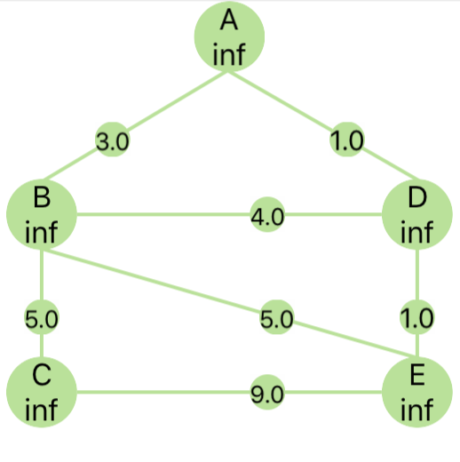

The table below represents graph state:

|                           |  A  |  B  |  C  |  D  |  E  |
|:------------------------- |:---:|:---:|:---:|:---:|:---:|
| Visited                   |  F  |  F  |  F  |  F  |  F  |
| Path Length From Start    | inf | inf | inf | inf | inf |
| Path Vertices From Start  | [ ] | [ ] | [ ] | [ ] | [ ] |

>inf is equal infinity which basically means that algorithm doesn't know how far away is this vertex from start one.

>F states for False

>T states for True

To initialize our graph we have to set source vertex path length from source vertex to 0 and append itself to path vertices from start.

|                           |  A  |  B  |  C  |  D  |  E  |
|:------------------------- |:---:|:---:|:---:|:---:|:---:|
| Visited                   |  F  |  F  |  F  |  F  |  F  |
| Path Length From Start    |  0  | inf | inf | inf | inf |
| Path Vertices From Start  | [A] | [ ] | [ ] | [ ] | [ ] |

Great, now our graph is initialised and we can pass it to the Dijkstra's algorithm, let's start!

Let's follow the algorithm's cycle and pick the first vertex which neighbours we want to check.
All our vertices are not visited but there is only one has the smallest path length from start. It is A. This vertex is the first one which neighbors we will check.
First of all, set this vertex as visited.

A.visited = true

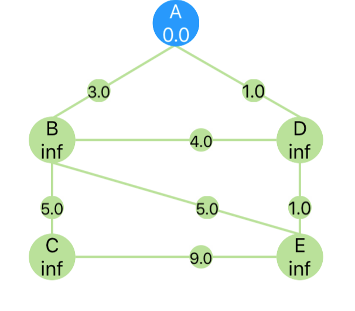

After this step graph has this state:

|                           |  A  |  B  |  C  |  D  |  E  |
|:------------------------- |:---:|:---:|:---:|:---:|:---:|
| Visited                   |  T  |  F  |  F  |  F  |  F  |
| Path Length From Start    |  0  | inf | inf | inf | inf |
| Path Vertices From Start  | [A] | [ ] | [ ] | [ ] | [ ] |

### Step 1

Then we check all of its neighbours.
If checking vertex path length from start + edge weight is smaller than neighbour's path length from start then we set neighbour's path length from start new value and append to its pathVerticesFromStart array new vertex: checkingVertex. Repeat this action for every vertex.

for clarity:
```swift
if (A.pathLengthFromStart + AB.weight) < B.pathLengthFromStart {
    B.pathLengthFromStart = A.pathLengthFromStart + AB.weight
    B.pathVerticesFromStart = A.pathVerticesFromStart
    B.pathVerticesFromStart.append(B)
}
```
And now our graph looks like this one:

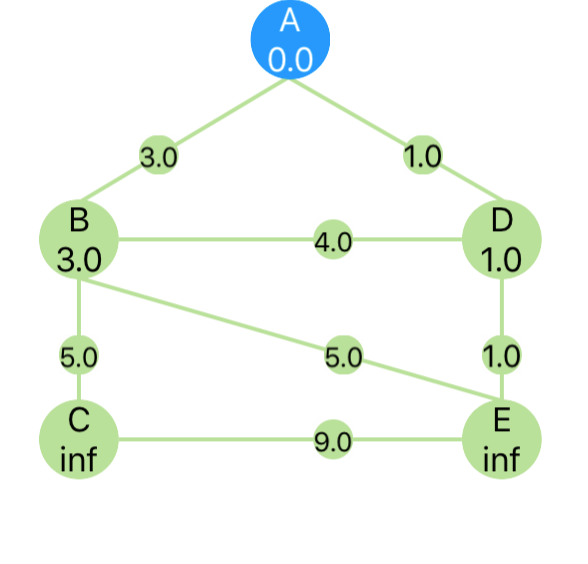

And its state is here:

|                           |     A      |     B      |     C      |     D      |     E      |
|:------------------------- |:----------:|:----------:|:----------:|:----------:|:----------:|
| Visited                   |     T      |     F      |     F      |     F      |     F      |
| Path Length From Start    |     0      |     3      |    inf     |     1      |    inf     |
| Path Vertices From Start  |    [A]     |   [A, B]   |    [ ]     |   [A, D]   |    [ ]     |

### Step 2

From now we repeat all actions again and fill our table with new info!

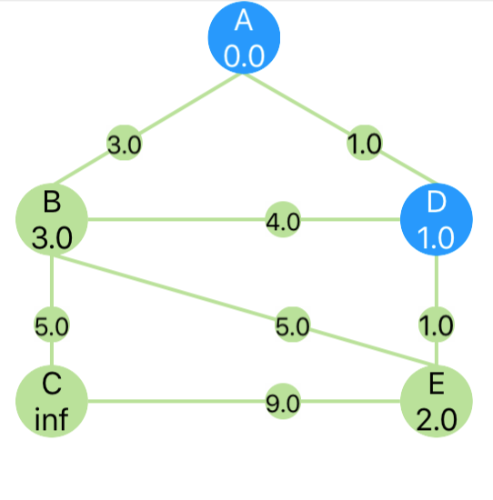

|                           |     A      |     B      |     C      |     D      |     E      |
|:------------------------- |:----------:|:----------:|:----------:|:----------:|:----------:|
| Visited                   |     T      |     F      |     F      |     T      |     F      |
| Path Length From Start    |     0      |     3      |    inf     |     1      |     2      |
| Path Vertices From Start  |    [A]     |   [A, B]   |    [ ]     |   [A, D]   | [A, D, E]  |

### Step 3

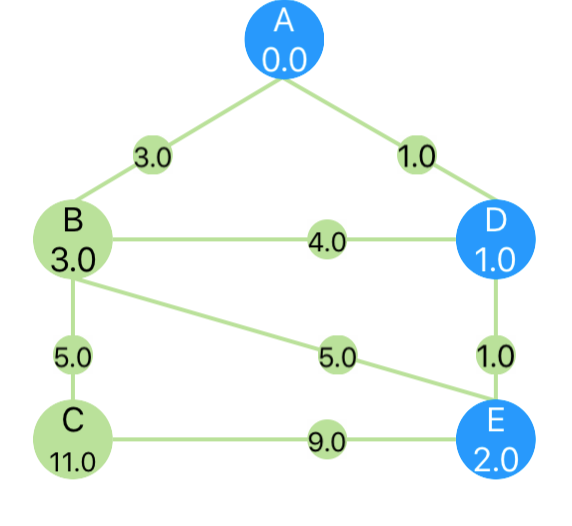

|                           |     A      |     B      |     C      |     D      |     E      |
|:------------------------- |:----------:|:----------:|:----------:|:----------:|:----------:|
| Visited                   |     T      |     F      |     F      |     T      |     T      |
| Path Length From Start    |     0      |     3      |     11     |     1      |     2      |
| Path Vertices From Start  |    [A]     |   [A, B]   |[A, D, E, C]|   [A, D]   | [A, D, E ] |

### Step 4

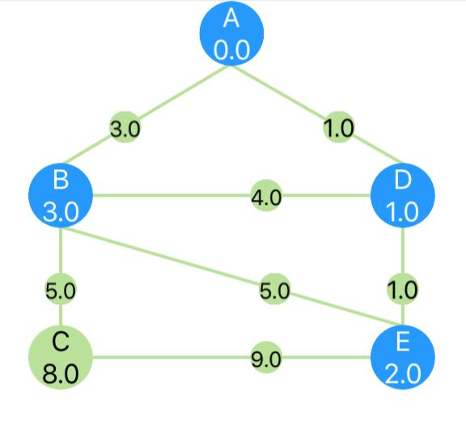

|                           |     A      |     B      |     C      |     D      |     E      |
|:------------------------- |:----------:|:----------:|:----------:|:----------:|:----------:|
| Visited                   |     T      |     T      |     F      |     T      |     T      |
| Path Length From Start    |     0      |     3      |     8      |     1      |     2      |
| Path Vertices From Start  |    [A]     |   [A, B]   |   [A, B, C]|   [A, D]   | [A, D, E ] |

### Step 5

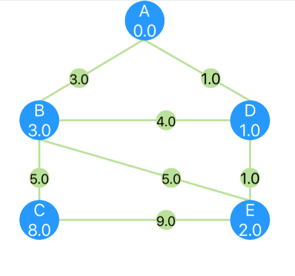

|                           |     A      |     B      |     C      |     D      |     E      |
|:------------------------- |:----------:|:----------:|:----------:|:----------:|:----------:|
| Visited                   |     T      |     T      |     T      |     T      |     T      |
| Path Length From Start    |     0      |     3      |     8      |     1      |     2      |
| Path Vertices From Start  |    [A]     |   [A, B]   |   [A, B, C]|   [A, D]   | [A, D, E ] |


## Code implementation
First of all, let’s create class that will describe any Vertex in the graph.
It is pretty simple
```swift
open class Vertex {

    //Every vertex should be unique that's why we set up identifier
    open var identifier: String

    //For Dijkstra every vertex in the graph should be connected with at least one other vertex. But there can be some usecases
    //when you firstly initialize all vertices without neighbours. And then on next iteration you set up their neighbours. So, initially neighbours is an empty array.
    //Array contains tuples (Vertex, Double). Vertex is a neighbour and Double is as edge weight to that neighbour.
    open var neighbours: [(Vertex, Double)] = []

    //As it was mentioned in the algorithm description, default path length from start for all vertices should be as much as possible.
    //It is var because we will update it during the algorithm execution.
    open var pathLengthFromStart = Double.infinity

    //This array contains vertices which we need to go through to reach this vertex from starting one
    //As with path length from start, we will change this array during the algorithm execution.
    open var pathVerticesFromStart: [Vertex] = []

    public init(identifier: String) {
        self.identifier = identifier
    }

    //This function let us use the same array of vertices again and again to calculate paths with different starting vertex.
    //When we will need to set new starting vertex and recalculate paths then we will simply clear graph vertices' cashes.
    open func clearCache() {
        pathLengthFromStart = Double.infinity
        pathVerticesFromStart = []
    }
}
```

As every vertex should be unique it is useful to make them Hashable and according Equatable. We use an identifier for this purposes.
```swift
extension Vertex: Hashable {
    open var hashValue: Int {
        return identifier.hashValue
    }
}

extension Vertex: Equatable {
    public static func ==(lhs: Vertex, rhs: Vertex) -> Bool {
        return lhs.hashValue == rhs.hashValue
    }
}
```

We've created a base for our algorithm. Now let's create a house :)
Dijkstra's realisation is really straightforward.
```swift
public class Dijkstra {
    //This is a storage for vertices in the graph.
    //Assuming that our vertices are unique we can use Set instead of array. This approach will bring some benefits later.
    private var totalVertices: Set<Vertex>

    public init(vertices: Set<Vertex>) {
        totalVertices = vertices
    }

    //Remember clearCache function in the Vertex class implementation?
    //This is just a wrapper that cleans cache for all stored vertices.
    private func clearCache() {
        totalVertices.forEach { $0.clearCache() }
    }

    public func findShortestPaths(from startVertex: Vertex) {
	//Before we start searching the shortest path from startVertex,
	//we need to clear vertices cache just to be sure that out graph is clean.
	//Remember that every Vertex is a class and classes are passed by reference.
	//So whenever you change vertex outside of this class it will affect this vertex inside totalVertices Set
        clearCache()
	//Now all our vertices have Double.infinity pathLengthFromStart and an empty pathVerticesFromStart array.

	//The next step in the algorithm is to set startVertex pathLengthFromStart and pathVerticesFromStart
        startVertex.pathLengthFromStart = 0
        startVertex.pathVerticesFromStart.append(startVertex)

	//Here starts the main part. We will use while loop to iterate through all vertices in the graph.
	//For this purpose we define currentVertex variable which we will change in the end of each while cycle.
        var currentVertex: Vertex? = startVertex

        while let vertex = currentVertex {

    	    //Next line of code is an implementation of setting vertex as visited.
    	    //As it has been said, we should check only unvisited vertices in the graph,
	    //So why don't just delete it from the set? This approach let us skip checking for *"if !vertex.visited then"*
            totalVertices.remove(vertex)

	    //filteredNeighbours is an array that contains current vertex neighbours which aren't yet visited
            let filteredNeighbours = vertex.neighbours.filter { totalVertices.contains($0.0) }

	    //Let's iterate through them
            for neighbour in filteredNeighbours {
		//These variable are more representative, than neighbour.0 or neighbour.1
                let neighbourVertex = neighbour.0
                let weight = neighbour.1

		//Here we calculate new weight, that we can offer to neighbour.
                let theoreticNewWeight = vertex.pathLengthFromStart + weight

		//If it is smaller than neighbour's current pathLengthFromStart
		//Then we perform this code
                if theoreticNewWeight < neighbourVertex.pathLengthFromStart {

		    //set new pathLengthFromStart
                    neighbourVertex.pathLengthFromStart = theoreticNewWeight

		    //set new pathVerticesFromStart
                    neighbourVertex.pathVerticesFromStart = vertex.pathVerticesFromStart

		    //append current vertex to neighbour's pathVerticesFromStart
                    neighbourVertex.pathVerticesFromStart.append(neighbourVertex)
                }
            }

	    //If totalVertices is empty, i.e. all vertices are visited
	    //Than break the loop
            if totalVertices.isEmpty {
                currentVertex = nil
                break
            }

	    //If loop is not broken, than pick next vertex for checkin from not visited.
	    //Next vertex pathLengthFromStart should be the smallest one.
            currentVertex = totalVertices.min { $0.pathLengthFromStart < $1.pathLengthFromStart }
        }
    }
}
```

That's all! Now you can check this algorithm in the playground. On the main page there is a code for creating a random graph.

Also there is a **VisualizedDijkstra.playground**. Use it to figure out the algorithm's flow in real (slowed :)) time.

It is up to you how to implement some specific parts of the algorithm, you can use Array instead of Set, add _visited_ property to Vertex or you can create some local totalVertices Array/Set inside _func findShortestPaths(from startVertex: Vertex)_ to keep totalVertices Array/Set unchanged. This is a general explanation with one possible implementation :)

# About this repository

This repository contains two playgrounds:
* To understand how does this algorithm works, I created **VisualizedDijkstra.playground.** It works in auto and interactive modes. Moreover, there are play/pause/stop buttons.
* If you need only realisation of the algorithm without visualisation then run **Dijkstra.playground.** It contains necessary classes and couple functions to create random graph for algorithm testing.

# Demo video

Click the link: [YouTube](https://youtu.be/PPESI7et0cQ)

# Credits

WWDC 2017 Scholarship Project (Rejected) created by [Taras Nikulin](https://github.com/crabman448)
