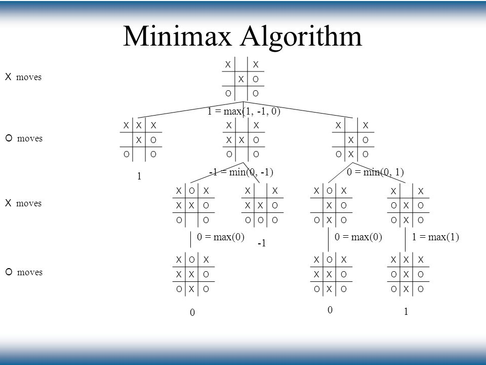

# Minimax algorithm

<p align="center">  </p>

## Runtime environment


## Table of contents
* [General info](#general-info)
* [Functionality](#functionality)
* [Pseudocode](#pseudocode)
* [Demo](#demo)
* [Sources](#sources)

## General info
It is an example of implementation and use ``minimax algorithm`` in ``Tic Tac Toe`` game. Minimax is an algorithm that searches deeply into all possible states in the game. There are two types of players in the algorithm. One that wants to maximize the state of the game and one that wants to minimaze the state of the game. There are three states in the tic-tac-toe game:
- `` -1 `` - if the minimizing player wins
- `` 0 `` - in case of a tie
- `` 1 `` - if the maximizing player wins

``Alpha-beta prunning`` this is a method that interrupts the search of those branches that do not lead to win. Alpha for maximizing player and beta for minimizing player. Alpha-beta prunnings reduce the time complexity of the algorithm.

Parameters:
- ``searching depth`` - how many moves in depth is to be calculated by the algorithm

Input:
- ``actual board state`` - in the form of an array for players symbols (cross/circle)
- ``two player symbols`` - cross / circle

Output:
- ``the best move for autonomus(AI) player`` - Position(row: Int, column: Int)

## Functionality
- example of use in Swift Playground with interactive UIView
- unit tests in XCode

## Pseudocode

```
function alphabeta(node, depth, α, β, maximizingPlayer) is
    if depth = 0 or node is a terminal node then
        return the heuristic value of node
    if maximizingPlayer then
        value := −∞
        for each child of node do
            value := max(value, alphabeta(child, depth − 1, α, β, FALSE))
            if value ≥ β then
                break (* β cutoff *)
            α := max(α, value)
        return value
    else
        value := +∞
        for each child of node do
            value := min(value, alphabeta(child, depth − 1, α, β, TRUE))
            if value ≤ α then
                break (* α cutoff *)
            β := min(β, value)
        return value
```

## Demo

<p align="center">  </p>

## Sources
* Minimax algorithm: https://en.wikipedia.org/wiki/Minimax
* Alpha-beta prunning: https://en.wikipedia.org/wiki/Alpha–beta_pruning

## Author
Written by Michał Nowak(mnowak061)
