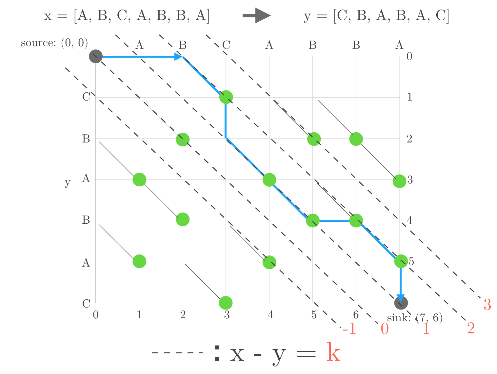

#  Myers Difference Algorithm

Myers Difference Algorithm(MDA) is an algorithm that finds a longest common subsequence(LCS) or shortest edit scripts(SES) of two sequences. The common subsequence of two sequences is the sequence of elements that appear in the same order in both sequences. For example, let's assume you have two arrays:

```
let firstArray = [1, 2, 3]
let secondArray = [2, 3, 4]
```

The common subsequences of these two arrays are `[2]`, and `[2, 3]`. The longest common sequence in this case is `[2, 3]`. MDA can accomplish this in O(ND) time, where N is the sum of the lengths of the two sequences. 

## Finding the length of the Longest Common Subsequence with Myers Algorithm on Edit Graph

### Edit Graph

MDA uses an **Edit Graph** to solve the LCS/SES problem. Below is a illustration depicting an edit graph:



The x-axis at the top of the graph represents one of the sequences, `X`. The y-axis at the left side of the graph represents the other sequence, `Y`. Hence, the two sequences in question is the following:

```
X = [A, B, C, A, B, B, A]
Y = [C, B, A, B, A, C]
```

MDA generates the edit graph through the following steps:

1. Line the element of sequence `X` on the x axis. And do for `Y` on the y axis.
2. Make grid and vertex at each point in the grid (x, y), `x in [0, N] and y in [0, M]`. `N` is the length of sequence `X`, `M` is of `Y`
3. Line for `x - y = k`, this line called k-line. Black dot line is this and pink number is the value of k.
3. Check the points `(i, j)`, where `X[i] = Y[j]`, called match point, light green one.
4. Connect vertex `(i - 1, j - 1)` and vertex `(i, j)`, where `(i, j)` is match point, then diagonal edge appears.

Each elements on the figure shows that,
- `Red number and dotted lines`: The red number is the value of k and dotted lines are k-line.
- `Green dots: The match points`, which is the point `(i, j)` where `X[i] == Y[j]`
- `Blue line`: The shortest path from source to sink, which is the path we are going to find finally.

> **Note:** Here, the sequences' start index is 1 not 0, so `X[1] = A`, `Y[1] = C`

We discuss about which path is the shortest from `source` to `sink`. Can move on the edges on the graph. I mean we can move on  the grid, horizontal and vertical edges, and the diagonal edges.

The movements are compatible with the `Edit Scripts`, insert or delete. The word `Edit Scripts` appeared here, as referred at Introduction, SES is Shortest Edit Scripts.

Let's get back on track. On this edit graph, the horizontal movement to vertex `(i, j)` is compatible with the script  `delete at index i from X`, the vertical movement to vertex `(i, j)` is compatible with the script `insert the element of Y at index j to immediately after the element of X at index i`. How about for the diagonal movement?. This movement to vertex `(i, j)` means `X[i] = Y[j]`, so no script needs.

- horizontal movement -> delete
- vertical movement -> insert
- diagonal movement -> no script because both are same.

Next, add cost 1 for non-diagonal movement, because they can be compatible with script. And 0 for diagonal movement, same means no script.

The total cost for the minimum path, exploring from `source` to `sink`, is the same as the length of the Longest Common Subsequence or Shortest Edit Script.

So, LCS/SES problem can be solved by finding the shortest path from `source` to `sink`.

### Myers Algorithm

As mentioned above, the problem of finding a shortest edit script can be reduced to finding a path from `source (0, 0)` to `sink (N, M)` with the fewest number of horizontal and vertical edges. Let `D-path` be a path starting at `source` that has exactly `D` non-diagonal edges, or must move non-diagonally D-times.

For example, A 0-path consists solely of diagonal edges. This means both sequences are completely same.

By a simple induction, D-path must consist of a (D-1)-path followed by a non-diagonal edge and then diagonal edges, which called `snake`. The minimum value of D is 0, both sequences being same. To the contrary, the maximum value of D is N + M because delete all elements from X and insert all elements from Y to X is the worst case edit scripts. For getting D, or the length of SES, running loop from 0 to N + M is enough.

```swift
for D in 0...N + M
```

Next, thinking about, where is the furthest reaching point for D-path on k-line. Like below, moving horizontally from k-line reaches (k+1)-line, moving vertically from k-line reaches (k-1)-line. Red chalky line shows that.


So, threre are several end points of D-path, or D-path can end on several k-line. We need the information to get the next path ((D+1)-path) as mentioned above. In fact, D-path must end on
k-line, where k in { -D, -D + 2, ....., D - 2, D }. This is so simple, starting point, `source` is `(0, 0)` on (k=0)-line. D is the number of non-diagonal edges and non-diagonal movement changes current k-line to (kpm1)-line. Because 0 is even number, if D is even number D-path will end on (even_k)-line, if D is odd number D-path will end on (odd_k)-line.

Searching loop outline will be below.

```swift
for D in 0...N + M {
    for k in stride(from: -D, through: D, by: 2) {
        //Find the end point of the furthest reaching D-path in k-line.
        if furthestReachingX == N && furthestReachingY == M {
            // The D-path is the shortest path
            // D is the length of Shortest Edit Script
            return
        }
    }
}
```

The D-path on k-line can be decomposed into
- a furthest reaching (D-1)-path on (k-1)-line, followed by a horizontal edge, followed by `snake`.
- a furthest reaching (D-1)-path on (k+1)-line, followed by a vertical edge, followed by `snake`.
as discussed above.

The Myers Algorithm key point are these.
- D-path must end on k-line, where k in { -D, -D + 2, ....., D - 2, D }
- The D-path on k-line can be decomposed into two patterns

thanks for these, the number of calculation become less.

```swift
public struct MyersDifferenceAlgorithm<E: Equatable> {
    public static func calculateShortestEditDistance(from fromArray: Array<E>, to toArray: Array<E>) -> Int {
        let fromCount = fromArray.count
        let toCount = toArray.count
        let totalCount = toCount + fromCount
        var furthestReaching = Array(repeating: 0, count: 2 * totalCount + 1)

        let isReachedAtSink: (Int, Int) -> Bool = { x, y in
            return x == fromCount && y == toCount
        }

        let snake: (Int, Int, Int) -> Int = { x, D, k in
            var _x = x
            while _x < fromCount && _x - k < toCount && fromArray[_x] == toArray[_x - k] {
                _x += 1
            }
            return _x
        }

        for D in 0...totalCount {
            for k in stride(from: -D, through: D, by: 2) {
                let index = k + totalCount
            
                // (x, D, k) => the x position on the k_line where the number of scripts is D
                // scripts means insertion or deletion
                var x = 0
                if D == 0 { }
                    // k == -D, D will be the boundary k_line
                    // when k == -D, moving right on the Edit Graph(is delete script) from k - 1_line where D - 1 is unavailable.
                    // when k == D, moving bottom on the Edit Graph(is insert script) from k + 1_line where D - 1 is unavailable.
                    // furthestReaching x position has higher calculating priority. (x, D - 1, k - 1), (x, D - 1, k + 1)
                else if k == -D || k != D && furthestReaching[index - 1] < furthestReaching[index + 1] {
                    // Getting initial x position
                    // ,using the furthestReaching X position on the k + 1_line where D - 1
                    // ,meaning get (x, D, k) by (x, D - 1, k + 1) + moving bottom + snake
                    // this moving bottom on the edit graph is compatible with insert script
                    x = furthestReaching[index + 1]
                } else {
                    // Getting initial x position
                    // ,using the futrhest X position on the k - 1_line where D - 1
                    // ,meaning get (x, D, k) by (x, D - 1, k - 1) + moving right + snake
                    // this moving right on the edit graph is compatible with delete script
                    x = furthestReaching[index - 1] + 1
                }
                
                // snake
                // diagonal moving can be performed with 0 cost.
                // `same` script is needed ?
                let _x = snake(x, D, k)
                
                if isReachedAtSink(_x, _x - k) { return D }
                furthestReaching[index] = _x
            }
        }

        fatalError("Never comes here")
    }
}
```
