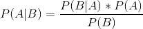
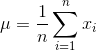
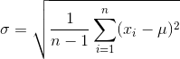
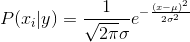
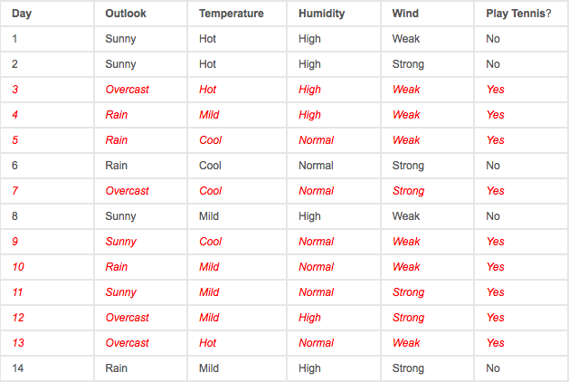
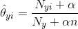
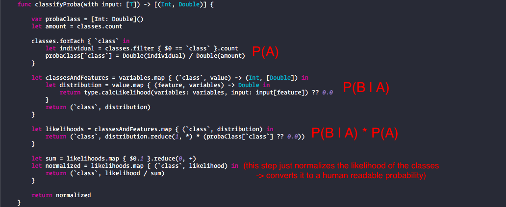

# Naive Bayes Classifier

> ***Disclaimer:*** Do not get scared of complicated formulas or terms, I will describe them right after I use them. Also the math skills you need to understand this are very basic.

The goal of a classifier is to predict the class of a given data entry based on previously fed data and its features. 

Now what is a class or a feature? The best I can do is to describe it with a table. 
This is a dataset that uses height, weight and foot size of a person to illustrate the relationship between those values and the sex.

| Sex       | height (feet)          | weight(lbs)  | foot size (inches) |
| ------------- |:-------------:|:-----:|:---:|
| male      | 6     | 180 | 12  |
| male      | 5.92  | 190 | 11  |
| male      | 5.58  | 170 | 12  |
| male      | 5.92  | 165 | 10  |
| female    | 5     | 100 | 6   |
| female    | 5.5   | 150 | 8   |
| female    | 5.42  | 130 | 7   |
| female    | 5.75  | 150 | 9   |

The ***classes*** of this table is the data in the sex column (male/female). You "classify" the rest of the data and bind them to a sex.

The ***features*** of this table are the labels of the other columns (height, weight, foot size) and the numbers right under the labels.

Now that I've told you what a classifier is I will tell you what exactly a ***Naive Bayes classifier*** is. There are a lot of other classifiers out there but what's so special about this specific is that it only needs a very small dataset to get good results. The others like Random Forests normally need a very large dataset.

Why isn't this algorithm used more you might ask (or not). Because it is normally ***outperformed*** in accuracy by ***Random Forests*** or ***Boosted Trees***.

## Theory

The Naive Bayes classifier utilizes the ***Bayes Theorem*** (as its name suggests) which looks like this.

***P*** always means the probability of something.

***A*** is the class, ***B*** is the data depending on a feature and the ***pipe*** symbol means given. 

P(A | B) therefore is: probability of the class given the data (which is dependent on the feature).

This is all you have to know about the Bayes Theorem. The important thing for us is now how to calculate all those variables, plug them into this formula and you are ready to classify data.

### **P(A)**
This is the probability of the class. To get back to the example I gave before: Let's say we want to classify this data entry:

| height (feet)          | weight(lbs)  | foot size (inches) |
|:-------------:|:-----:|:---:|
| 6     | 130 | 8  |

What Naive Bayes classifier now does: it checks the probability for every class possible which is in our case either male or female. Look back at the original table and count the male and the female entries. Then divide them by the overall count of data entries.

P(male) = 4 / 8 = 0.5

P(female) = 4 / 8 = 0.5

This should be a very easy task to do. Basically just the probability of all classes.

### **P(B)**
This variable is not needed in a Naive Bayes classifier. It is the probability of the data. It does not change, therefore it is a constant. And what can you do with a constant? Exactly! Discard it. This saves time and code.

### **P(B | A)**
This is the probability of the data given the class. To calculate this I have to introduce you to the subtypes of NB. You have to decide which you use depending on your data which you want to classify.

### **Gaussian Naive Bayes**
If you have a dataset like the one I showed you before (continuous features -> `Double`s) you have to use this subtype. There are 3 formulas you need for Gaussian NB to calculate P(B | A).

and **P(x | y) = P(B | A)**

Again, very complicated looking formulas but they are very easy. The first formula with µ is just the mean of the data (adding all data points and dividing them by the count). The second with σ is the standard deviation. You might have heard of it somewhen in school. It is just the sum of all values minus the mean, squared and that divided by the count of the data minus 1 and a sqaure root around it. The third equation is the Gaussian or normal distribution if you want to read more about it I suggest reading [this](https://en.wikipedia.org/wiki/Normal_distribution).

Why the Gaussian distribution? Because we assume that the continuous values associated with each class are distributed according to the Gaussian distribution. Simple as that.

### **Multinomial Naive Bayes**

What do we do if we have this for examples:

We can't just calculate the mean of sunny, overcast and rainy. This is why we need the categorical model which is the multinomial NB. This is the last formula, I promise!

Now this is the number of times feature **i** appears in a sample **N** of class **y** in the data set divided by the count of the sample just depending on the class **y**. That θ is also just a fancy way of writing P(B | A).

You might have noticed that there is still the α in this formula. This solves a problem called "zero-frequency-problem". Because what happens if there is no sample with feature **i** and class **y**? The whole equation would result in 0 (because 0 / something is always 0). This is a huge problem but there is a simple solution to this. Just add 1 to any count of the sample (α = 1).

## Those formulas in action

Enough talking! This is the code. If you want a deeper explanation of how the code works just look at the Playground I provided.

*Written for Swift Algorithm Club by Philipp Gabriel*