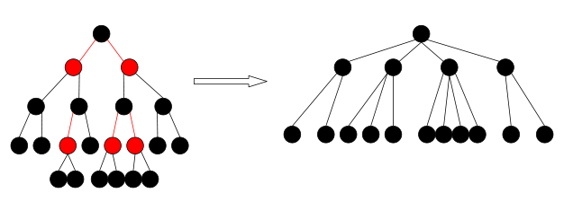
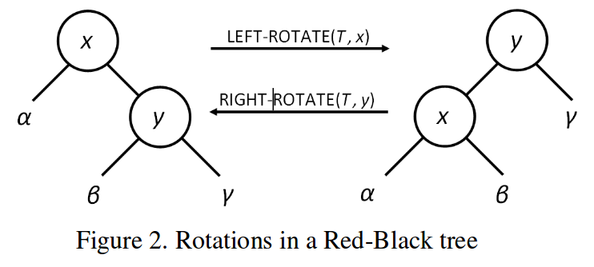

# Red Black Tree
  
Red-black trees are an evolution of binary search trees that aim to keep the tree balanced without affecting the complexity of the primitive operations. This is done by coloring each node in the tree with either red or black and preserving a set of properties that guarantee that the deepest path in the tree is not longer than twice the shortest one.  
## Motivation:
* We want a balanced binary search tree    
* Height of the tree is O(log n)  
* Red-Black Tree is an implementation of a balanced binary search tree


## Invariants:  
1. Every node is colored either red or black
2. All leaf (nil) nodes are colored with black; if a node’s child is missing then we will assume that it has a nil child in that place and this nil child is always colored black.
3. Both children of a red node must be black nodes.
4. Every path from a node n to a descendent leaf has the same number of black nodes (not counting node n).   

## Methods:

Since the red-black tree is a balanced BST, it supports the functions:
  * find(key)
  * Predecessor(key)
  * Successor(key)
  * Minimum(key)
  * maximum(key)
  * insert(key)
  * delete(key)    

Since an insertion or deletion may violate one of the invariant's of the red-black tree we must either change colors, or perform rotation actions.  

#Rotation  
To ensure that its color scheme and properties don’t get thrown off, red-black trees employ a key operation known as rotation. Rotation is a binary operation, between a parent node and one of its children, that swaps nodes and modifys their pointers while preserving the inorder traversal of the tree (so that elements are still sorted). There are two types of rotations: left rotation and right rotation. Left rotation swaps the parent node with its right child, while right rotation swaps the parent node with its left child.

###Left-Rotation:  
```c++
y ← x->right 
x->right ← y->left 
y->left->p ← x 
y->p ← x->p 
if 	x->p = Null 
	then   T->root ← y 
	else if x = x->p->left  
		then x->p->left ← y 
		else  x->p->right ← y 
y->left ← x 
x->p ← y 
```
###Right-Rotation:
```c++
y ← x->left 
x->left ← y->right 
y->right->p ← x 
y->p ← x->p 
if 	x->p = Null 
	then T->root ← y 
	else if x = x->p->right  
		then x->p->right ← y 
		else  x->p->left ← y 
y->right ← x 
x->p ← y 
```  
###Insertion:
When adding a new node to a binary search tree, note that the new node will always be a leaf in the tree. To insert a new node, all we will do is navigate the BST starting from the root. If the new node value is smaller than the current node value, we go left – if it is larger, we go right. When we reach a leaf node, the last step is to attach the new node as a child to this leaf node in a way that preserves the BST constraint. We must recheck the RBTree invariants to see if any were violated  

###Deletion:
The same concept behind red-black tree insertions applies here. Removing a node from a red-black tree makes use of the BST deletion procedure and then restores the red-black tree properties in O(log n). The total running time for the deletion process takes O(log n) time, then, which meets the complexity requirements for the primitive operations.  

See also [Wikipedia](https://en.wikipedia.org/wiki/Red%E2%80%93black_tree).  

*Written for the Swift Algorithm Club by Ashwin Raghuraman*

