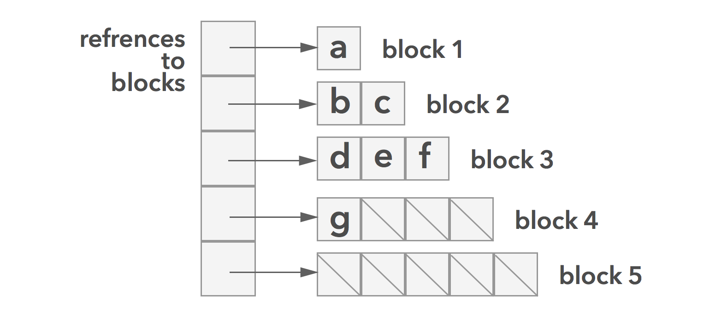
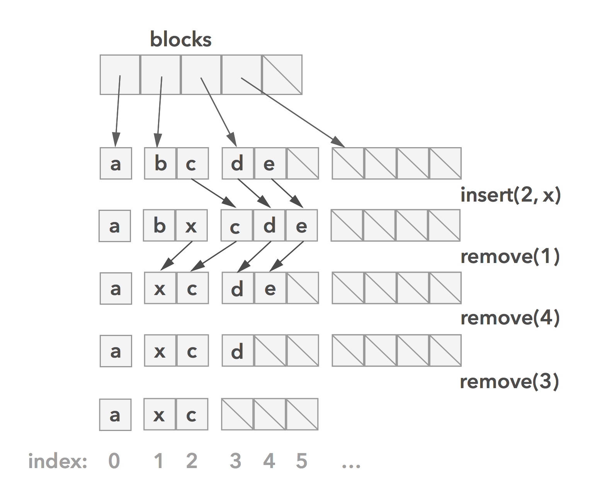
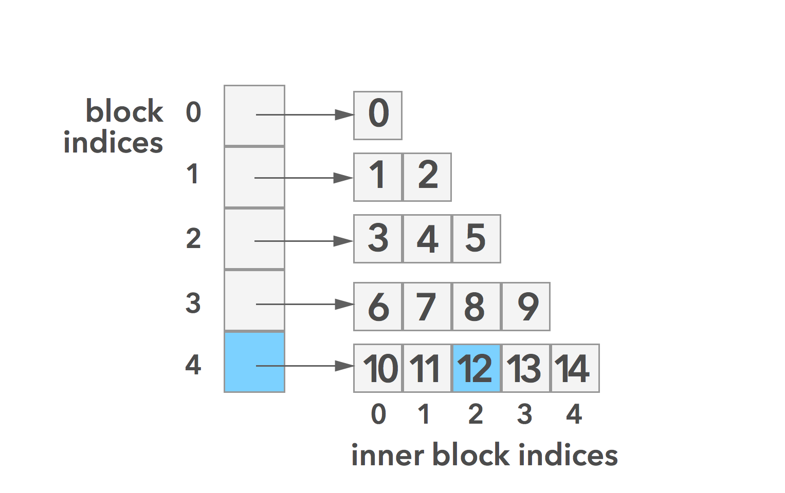

# Rootish Array Stack

A *Rootish Array Stack* is an ordered array based structure that minimizes wasted space (based on [Gauss's summation technique](https://betterexplained.com/articles/techniques-for-adding-the-numbers-1-to-100/)). A *Rootish Array Stack* consists of an array holding many fixed size arrays in ascending size.  



A resizable array holds references to blocks (arrays of fixed size). A block's capacity is the same as it's index in the resizable array. Blocks don't grow/shrink like regular Swift arrays. Instead, when their capacity is reached, a new slightly larger block is created. When a block is emptied the last block is freed. This is a great improvement on what Swift arrays do in terms of wasted space.



Here you can see how insert/remove operations would behave (very similar to how a Swift array handles such operations).

## Gauss' Summation Trick
One of the most well known legends about famous mathematician [Carl Friedrich Gauss](https://en.wikipedia.org/wiki/Carl_Friedrich_Gauss) goes back to when he was in primary school. One day, Gauss' teacher asked his class to add up all the numbers from 1 to 100, hoping that the task would take long enough for him to step out for a smoke break. The teacher was shocked when young Gauss had his hand up with the answer `5050`. So soon? The teacher suspected a cheat, but no. Gauss had found a formula to sidestep the problem of manually adding up all the numbers 1 by 1. His formula:
```
sum from 1...n = n * (n + 1) / 2
```
To understand this imagine `n` blocks where `x` represents `1` unit. In this example let `n` be `5`:
```
blocks:     [x] [x x] [x x x] [x x x x] [x x x x x]
# of x's:    1    2      3        4          5
```
_Block `1` has 1 `x`, block `2` as 2 `x`s, block `3` has 3 `x`s, etc..._

If you wanted to take the sum of all the blocks from `1` to `n`, you could go through and count them _one by one_. This is okay, but for a large sequence of blocks that could take a long time! Instead, you could arrange the blocks to look like a _half pyramid_:
```
# |  blocks
--|-------------
1 |  x
2 |  x x
3 |  x x x
4 |  x x x x
5 |  x x x x x

```
Then we mirror the _half pyramid_ and rearrange the image so that it fits with the original _half pyramid_ in a rectangular shape:
```
x                  o      x o o o o o
x x              o o      x x o o o o
x x x          o o o  =>  x x x o o o
x x x x      o o o o      x x x x o o
x x x x x  o o o o o      x x x x x o
```
Here we have `n` rows and `n + 1` columns. _5 rows and 6 columns_.

We can calculate the sum just as we would an area! Let's also express the width and height in terms of `n`:
```
area of a rectangle = height * width = n * (n + 1)
```
We only want to calculate the amount of `x`s, not the amount of `o`s. Since there's a 1:1 ratio between `x`s and `o`s we can just divide our area by 2!
```
area of only x = n * (n + 1) / 2
```
Voila! A super fast way to take a sum of all the blocks! This equation is useful for deriving fast `block` and `inner block index` equations.
<!-- TODO: Define block and innerBlockIndex -->

## Get/Set with Speed
Next, we want to find an efficient and accurate way to access an element at a random index. For example, which block does `rootishArrayStack[12]` point to? To answer this we will need more math!
Determining the inner block `index` turns out to be easy. If `index` is in some `block` then:
```
inner block index = index - block * (block + 1) / 2
```
Determining which `block` an index points to is more difficult. The number of elements up to and including the element requested is: `index + 1` elements. The number of elements in blocks `0...block` is `(block + 1) * (block + 2) / 2` (equation derived above). The relationship between the `block` and the `index` is as follows:
```
(block + 1) * (block + 2) / 2 >= index + 1
```
This can be rewritten as:
```
(block)^2 + (3 * block) - (2 * index) >= 0
```
Using the quadratic formula we get:
```
block = (-3 ± √(9 + 8 * index)) / 2
```
A negative block doesn't make sense, so we take the positive root instead. In general, this solution is not an integer. However, going back to our inequality, we want the smallest block such that `block => (-3 + √(9 + 8 * index)) / 2`. Next, we take the ceiling of the result:
```
block = ⌈(-3 + √(9 + 8 * index)) / 2⌉
```

Now we can figure out what `rootishArrayStack[12]` points to! First, let's see which block the `12` points to:
```
block = ⌈(-3 + √(9 + 8 * (12))) / 2⌉
block = ⌈(-3 + √105) / 2⌉
block = ⌈(-3 + (10.246950766)) / 2⌉
block = ⌈(7.246950766) / 2⌉
block = ⌈3.623475383⌉
block = 4
```
Next lets see which `innerBlockIndex` `12` points to:
```
inner block index = (12) - (4) * ((4) + 1) / 2
inner block index = (12) - (4) * (5) / 2
inner block index = (12) - 10
inner block index = 2
```
Therefore, `rootishArrayStack[12]` points to the block at index `4` and at inner block index `2`.


### Interesting Discovery
Using the `block` equation, we can see that the number of `blocks` is proportional to the square root of the number of elements: **O(blocks) = O(√n)**.

# Implementation Details
Let's start with instance variables and struct declaration:
```swift
import Darwin

public struct RootishArrayStack<T> {

  fileprivate var blocks = [Array<T?>]()
  fileprivate var internalCount = 0

  public init() { }

  var count: Int {
    return internalCount
  }

  ...

}

```
The elements are of generic type `T`, so data of any kind can be stored in the list. `blocks` will be a resizable array to hold fixed sized arrays that take type `T?`.
> The reason for the fixed size arrays taking type `T?` is so that references to elements aren't retained after they've been removed. Eg: if you remove the last element, the last index must be set to `nil` to prevent the last element being held in memory at an inaccessible index.

`internalCount` is an internal mutable counter that keeps track of the number of elements. `count` is a read only variable that returns the `internalCount` value. `Darwin` is imported here to provide simple math functions such as `ceil()` and `sqrt()`.

The `capacity` of the structure is simply the Gaussian summation trick:
```swift
var capacity: Int {
  return blocks.count * (blocks.count + 1) / 2
}
```

Next, let's look at how we would `get` and `set` elements:
```swift
fileprivate func block(fromIndex: Int) -> Int {
  let block = Int(ceil((-3.0 + sqrt(9.0 + 8.0 * Double(index))) / 2))
  return block
}

fileprivate func innerBlockIndex(fromIndex index: Int, fromBlock block: Int) -> Int {
  return index - block * (block + 1) / 2
}

public subscript(index: Int) -> T {
  get {
    let block = self.block(fromIndex: index)
    let innerBlockIndex = self.innerBlockIndex(fromIndex: index, fromBlock: block)
    return blocks[block][innerBlockIndex]!
  }
  set(newValue) {
    let block = self.block(fromIndex: index)
    let innerBlockIndex = self.innerBlockIndex(fromIndex: index, fromBlock: block)
    blocks[block][innerBlockIndex] = newValue
  }
}
```
`block(fromIndex:)` and `innerBlockIndex(fromIndex:, fromBlock:)` are wrapping the `block` and `inner block index` equations we derived earlier. `superscript` lets us have `get` and `set` access to the structure with the familiar `[index:]` syntax. For both `get` and `set` in `superscript` we use the same logic:

1. determine the block that the index points to
2. determine the inner block index
3. `get`/`set` the value

Next, let's look at how we would `growIfNeeded()` and `shrinkIfNeeded()`.
```swift
fileprivate mutating func growIfNeeded() {
  if capacity - blocks.count < count + 1 {
    let newArray = [T?](repeating: nil, count: blocks.count + 1)
    blocks.append(newArray)
  }
}

fileprivate mutating func shrinkIfNeeded() {
  if capacity + blocks.count >= count {
    while blocks.count > 0 && (blocks.count - 2) * (blocks.count - 1) / 2 >    count {
      blocks.remove(at: blocks.count - 1)
    }
  }
}
```
If our data set grows or shrinks in size, we want our data structure to accommodate the change.
Just like a Swift array, when a capacity threshold is met we will `grow` or `shrink` the size of our structure. For the Rootish Array Stack we want to `grow` if the second last block is full on an `insert` operation, and `shrink` if the two last blocks are empty.

Now to the more familiar Swift array behaviour.  
```swift
public mutating func insert(element: T, atIndex index: Int) {
	growIfNeeded()
	internalCount += 1
	var i = count - 1
	while i > index {
		self[i] = self[i - 1]
		i -= 1
	}
	self[index] = element
}

public mutating func append(element: T) {
	insert(element: element, atIndex: count)
}

public mutating func remove(atIndex index: Int) -> T {
	let element = self[index]
	for i in index..<count - 1 {
		self[i] = self[i + 1]
	}
	internalCount -= 1
	makeNil(atIndex: count)
	shrinkIfNeeded()
	return element
}

fileprivate mutating func makeNil(atIndex index: Int) {
  let block = self.block(fromIndex: index)
  let innerBlockIndex = self.innerBlockIndex(fromIndex: index, fromBlock: block)
  blocks[block][innerBlockIndex] = nil
}
```
To `insert(element:, atIndex:)` we move all elements after the `index` to the right by 1. After space has been made for the element, we set the value using the `subscript` convenience method.
`append(element:)` is just a convenience method to `insert` to the end.
To `remove(atIndex:)` we move all the elements after the `index` to the left by 1. After the removed value is covered by it's proceeding value, we set the last value in the structure to `nil`.
`makeNil(atIndex:)` uses the same logic as our `subscript` method but is used to set the root optional at a particular index to `nil` (because setting it's wrapped value to `nil` is something only the user of the data structure should do).
> Setting a optionals value to `nil` is different than setting it's wrapped value to `nil`. An optionals wrapped value is an embedded type within the optional reference. This means that a `nil` wrapped value is actually `.some(.none)` whereas setting the root reference to `nil` is `.none`. To better understand Swift optionals I recommend checking out @SebastianBoldt's article [Swift! Optionals?](https://medium.com/ios-os-x-development/swift-optionals-78dafaa53f3#.rvjobhuzs).

# Performance
* An internal counter keeps track of the number of elements in the structure. `count` is executed in **O(1)** time.

* `capacity` can be calculated using Gauss' summation trick in an equation which takes **O(1)** time to execute.

* Since `subcript[index:]` uses the `block` and `inner block index` equations, which can be executed in **O(1)** time, all get and set operations take **O(1)**.

* Ignoring the time cost to `grow` and `shrink`, `insert(atIndex:)` and `remove(atIndex:)` operations shift all elements right of the specified index resulting in **O(n)** time.

# Analysis of Growing and Shrinking
The performance analysis doesn't account for the cost to `grow` and `shrink`. Unlike a regular Swift array, `grow` and `shrink` operations don't copy all the elements into a backing array. They only allocate or free an array proportional to the number of `blocks`. The number of `blocks` is proportional to the  square root of the number of elements. Growing and shrinking only costs **O(√n)**.

# Wasted Space
Wasted space is how much memory with respect to the number of elements `n` is unused. The Rootish Array Stack never has more than 2 empty blocks and it never has less than 1 empty block. The last two blocks are proportional to the number of blocks, which is proportional to the square root of the number of elements. The number of references needed to point to each block is the same as the number of blocks. Therefore, the amount of wasted space with respect to the number of elements is **O(√n)**.


_Written for Swift Algorithm Club by @BenEmdon_

_With help from [OpenDataStructures.org](http://opendatastructures.org)_
