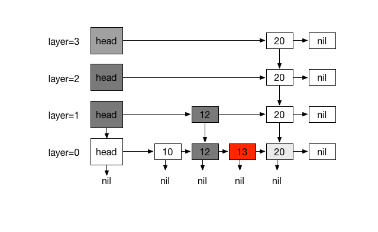
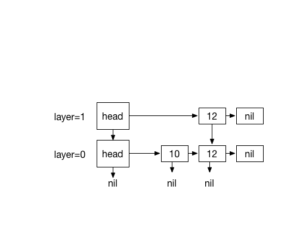
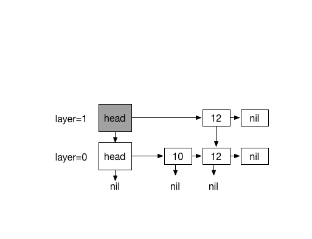
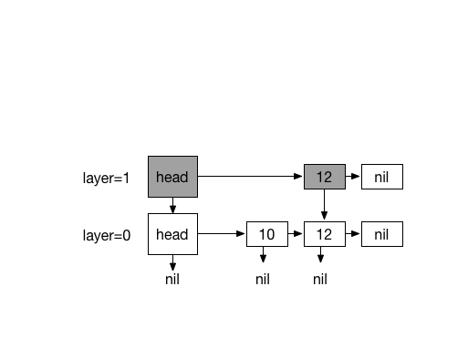
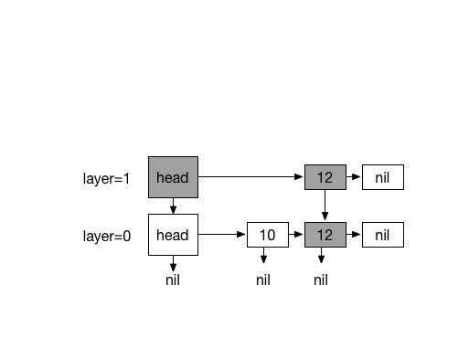
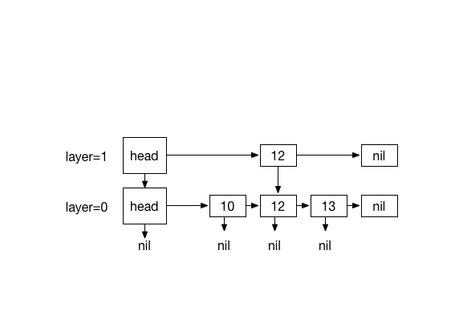
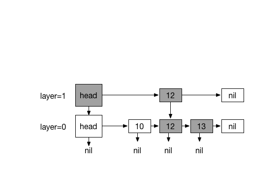
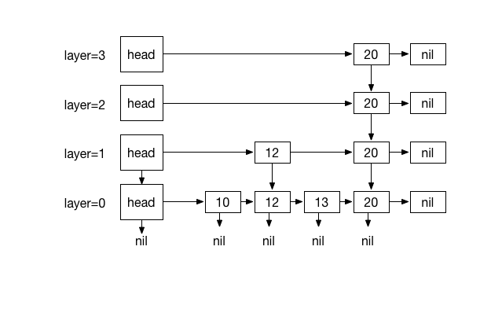

# Skip List

Skip List is a probablistic data-structure  with same logarithmic time bound and
efficiency  as AVL/  or  Red-Black  tree and  provides  a  clever compromise  to
efficiently support  search and update  operations and is relatively  simpler to
implement compared to other map data structures.

A skip  list *S*  consists of  series of  sorted linked  lists *{L0,  ..., Ln}*,
layered hierarchicaly and each layer *L* stores  a subset of items in layer *L0*
in incremental order.  The items in layers  *{L1, ... Ln}* are  chosen at random
based on a coin flipping function  with probability 1/2 .  For traversing, every
item in  a layer  hold references  to the node  below and  the next  node.  This
layers serve as  express lanes to the layer underneath  them, effectively making
fast O(log n) searching possible by  skipping lanes and reducing travel distance
and in worse case  searching degrades to O (n), as  expected with regular linked
list.

For a skip list *S*:

1. List *L0* contains every inserted item.
2.  For lists *{L1, ..., Ln}*, *Li*  contains a randomly generated subset of the
   items in *Li-1*
3. Height is determined by coin-flipping.

Figure 1

#Searching

Searching for  element *N* starts by  traversing from top most  layer *Ln* until
*L0*.

Our objective  is to find an  element *K* such  that its value at  the rightmost
position of current layer, is less-than  target item and its subsequent node has
a greater-equal  value or nil (  *K.key < N.key  <= (K.next.key or nil)*  ). if
value of *K.next* is equal to *N*,  search is terminated and we return *K.next*,
otherwise drop underneath using *K.down* to the node below ( at layer Ln-1 ) and
repeat the process until *L0* where *K.down* is `nil` which indicates that level
is *L0* and item doesn't exists.

###Example:

#Inserting

Inserting  element  *N*  has  a  similar process  as  searching.  It  starts  by
traversing from  top most layer *Ln*  until *L0*. We  need to keep track  of our
traversal path  using a  stack. It  helps us  to traverse  the path  upward when
coin-flipping starts, so we can insert  our new element and update references to
it.

Our objective  is to find  a element  *K* such that  its value at  the rightmost
position of  layer *Ln*,  is less-than new  item and its  subsequent node  has a
greater-equal value  or nil (  *K.key  < N.key <  (K.next.key or nil)*  ). Push
element *K*  to the stack and  with element *K*,  go down using *K.down*  to the
node below  ( at layer Ln-1  ) and repeat the  process ( forward searching  ) up
until  *L0* where  *K.down* is  `nil`  which indicates  that level  is *L0*.  We
terminate the process when *K.down* is nil.

At *L0*, *N* can be inserted after *K*.

Here is the  interesting part. We use coin flipping  function to randomly create
layers.

When  coin flip  function returns  0,  the whole  process is  finished but  when
returns 1, there are two possibilities:

1. Stack is empty ( Level is *L0* /- *Ln* or at uninitialized stage)
2. Stack has items ( traversing upward is possible )

In case 1:

A new layer M*  is created with a head node *NM* referencing  head node of layer
below  and *NM.next*  referencing new  element *N*.  New element  *N* referecing
element *N* at previous layer.

In case 2:

repeat until stack is empty Pop an item *F* from stack and update the references
accordingly.  *F.next* will be *K.next* and *K.next* will be *F*
	
when  stack  is  empty Create  a  new  layer  consisintg  of a  head  node  *NM*
referencing  head node  of layer  below  and *NM.next*  referencing new  element
*N*. New element *N* referencing element *N* at previous layer.
		 

###Example:

Inserting 13. with coin flips (0)

Inserting 20. with 4 times coin flips (1) 

#Removing

Removing works similar to insert procedure.

TODO

#See also

[Skip List on Wikipedia](https://en.wikipedia.org/wiki/Skip_list) 

Written for Swift Algorithm Club by [Mike Taghavi](https://github.com/mitghi)
