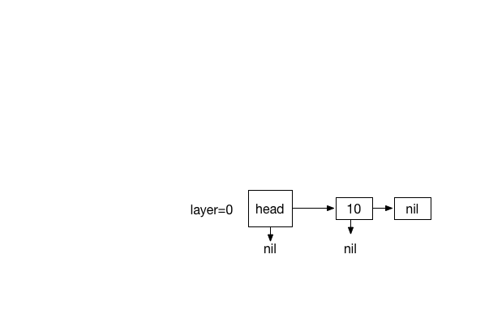

# Skip List

Skip List is a probablistic data-structure with same efficiency as AVL tree or Red-Black tree. The building blocks are hierarchy of layers (regular sorted linked-lists), created probablisticly by coin flipping, each acting as an express lane to the layer underneath, therefore making fast O(log n) search possible by skipping lanes and reducing travel distance. A layer consists of a Head node, holding reference to the subsequent and the node below. Each node also holds similar references as the Head node.

#Inserting

1. Inserting a new element in initial state where no prior layer is created yet begins by construction of a Head node with a reference to data node (just like regular lists). After this operation coin-flipping starts to determine wether a new layer must be created. When positive, a new layer containing Head and data node ( similar to previous layer ) is created and head is updated to reference the new layer and the head node underneath. Subsequently data node is also updated to reference the node below; until coin-flip function return a negative value to terminate this process.

2. After initial state, we start at top most layer to find a node where its value is less than the new value and its next node value is greater-equal/nil than new value. Then we use this node to travel to layer underneath until we reach the layer 0 where the element must be inserted first, after this node. Node references must be updated accordingly by back tracing the path to the top. If the first element in the layer does not meet the criteria, same procedure is used to travel to the layer below using the head node.

**Example**

1 - Inserting 10 in initial state with coin flips (0)

2 - 12 inserted with coin flips (1,1,0)

3 - Inserting 13. with coin flips (0)

#Searching

TODO

#See also

[Skip List on Wikipedia](https://en.wikipedia.org/wiki/Skip_list) 

Written for Swift Algorithm Club by [Mike Taghavi](https://github.com/mitghi)
