# Splay Tree
Splay tree is a data structure, structurally identitical to a balanced binary search tree. Every operation performed on a Splay Tree causes a readjustment in order to provide fast access to recently operated values. On every access, the tree is rearranged and the node accessed is moved to the root of the tree using a set of specific rotations, which together are referred to as **Splaying**.


## Rotations

There are 3 types of rotations that can form an **Splaying**:

- ZigZig
- ZigZag
- Zig

### Zig-Zig

Given a node *a* if *a* is not the root, and *a* has a child *b*, and both *a* and *b* are left children or right children, a **Zig-Zig** is performed.

### Case both nodes right children


### Case both nodes left children
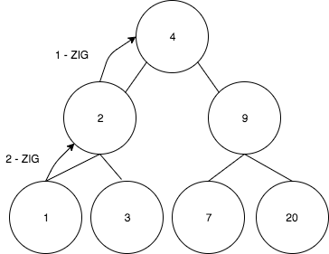

**IMPORTANT** is to note that a *ZigZig* performs first the rotation of the middle node with its parent (call it the grandparent) and later the rotation of the remaining node (grandchild). Doing that helps to keep the trees balanced even if it was first created by inserted a sequence of increasing values (see below worst case scenario followed by an explanation about why ZigZig rotates first to the grandparent).

### Zig-Zag

Given a node *a* if *a* is not the root, and *a* has a child *b*, and *b* is the left child of *a* being the right child (or the opposite), a **Zig-Zag** is performed.

### Case right - left


### Case left - right
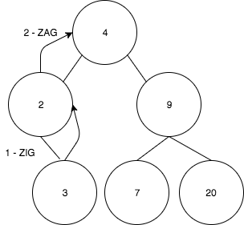

**IMPORTANT** A *ZigZag* performs first the rotation of the grandchild node and later the same node with its new parent again. 

### Zig

A **Zig** is performed when the node *a* to be rotated has the root as parent.


## Splaying

Splaying consists in making so many rotations as needed until the node affected by the operation is at the top and becomes the root of the tree.

```
while (node.parent != nil) {
    operation(forNode: node).apply(onNode: node)
}
```

Where operation returns the required rotation to be applied. 

```
public static func operation<T>(forNode node: Node<T>) -> SplayOperation {
    
    if let parent = node.parent, let _ = parent.parent {
        if (node.isLeftChild && parent.isRightChild) || (node.isRightChild && parent.isLeftChild) {
            return .zigZag
        }
        return .zigZig
    }
    return .zig
}
```

During the applying phase, the algorithms determines which nodes are involved depending on the rotation to be applied and proceeding to re-arrange the node with its parent.

```
public func apply<T>(onNode node: Node<T>) {
    switch self {
    case .zigZag:
        assert(node.parent != nil && node.parent!.parent != nil, "Should be at least 2 nodes up in the tree")
        rotate(child: node, parent: node.parent!)
        rotate(child: node, parent: node.parent!)

    case .zigZig:
        assert(node.parent != nil && node.parent!.parent != nil, "Should be at least 2 nodes up in the tree")
        rotate(child: node.parent!, parent: node.parent!.parent!)
        rotate(child: node, parent: node.parent!)
    
    case .zig:
        assert(node.parent != nil && node.parent!.parent == nil, "There should be a parent which is the root")
        rotate(child: node, parent: node.parent!)
    }
}
```


## Operations on an Splay Tree

### Insertion 

To insert a value:

- Insert it as in a binary search tree
- Splay the value to the root

### Deletion 

To delete a value: 

- Delete it as in a binary search tree 
- Splay the parent of the removed node to the root 

### Search 

To search a value: 

- Search for it as in a binary search tree 
- Splay the node containing the value to the root 
- If not found splay the node that would had been the parent of the searched value 

### Minimum and maximum 

- Search the tree for the required value 
- Splay the node to the root 

## Examples 

### Example 1

Lets suppose a *find(20)* operation was performed and now the values **20** needs to be splayed to the root. 
The sequence of steps will be the following: 


1. Since we are in a *ZigZig* case, we need to rotate **9** to **4**

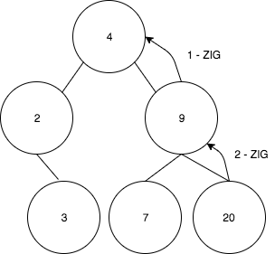

2. We got the following tree after the first rotation: 


3. And finally the **20** is rotated to the **9**

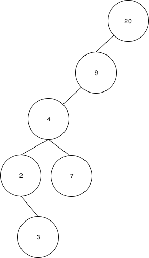


### Example 2

Now suppose a *insert(7)* operation was performed and we're in a *ZigZag* case.


1. First **7** is rotated to **9**


2. And the result tree is: 

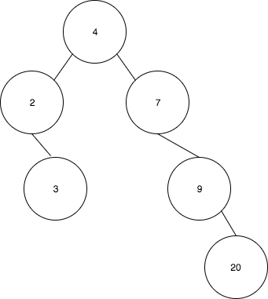

3. Finally **7** is rotated to **4**

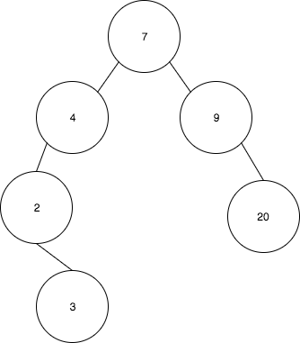


## Advantages 

Splay trees provide an efficient way to quickly access elements that are frequently requested. This characteristic makes then a good choice to implement, for example, caches or garbage collection algorithms, or in any other problem involving frequent access to a certain numbers of elements from a data set.

## Disadvantages

Splay tree are not perfectly balanced always, so in case of accessing all the elements in the tree in an increasing order, the height of the tree becomes *n*.

## Time complexity

| Case        |    Performance        |
| ------------- |:-------------:|
| Average      | O(log n) |
| Worst      | n |

With *n* being the number of items in the tree.

# An example of the Worst Case Performance 

Suppose the a sequence of consecutive values are inserted in an Splay Tree. 
Let's take for example [1,2,3,4,5,6,7,8].

The tree construction will be like following: 


1. Insert the number **1**

2. Insert **2** 


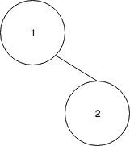


3. Splay **2** to the root 


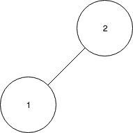


4. Insert **3** 


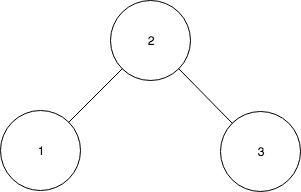

5. Splay **3** to the root 


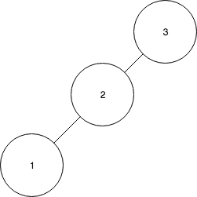


6. Insert **4** 


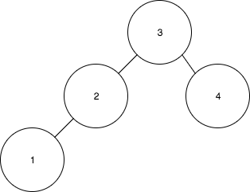


7. After inserting the rest of the values the tree will look like this: 


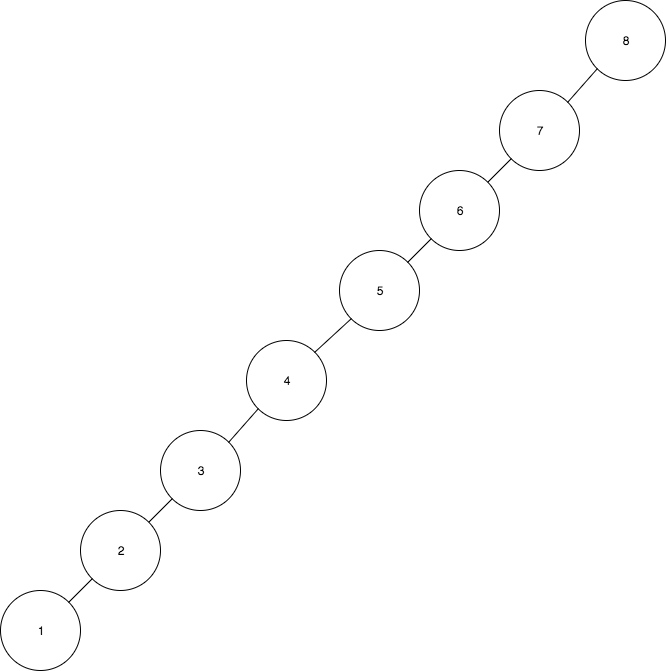


If we keep insert number following the same sequence, that tree becomes inbalanced and have a height of **n** with **n** being the numbers of values inserted. 
After getting this tree, a *find(1)* operation for example will take **O(n)**

## ZigZig rotation order: first grandparent

But thanks to the properties of the **Splay Tree** and the *ZigZig* rotations after the *find(1)* operation the tree becomes balanced again. This only happens if we respect the order of the *ZigZig* rotation, and the rotation to the grandparent happens first. 

The sequence of *ZigZigs* rotations will look like follows: 

1. Rotate **2** to **3**

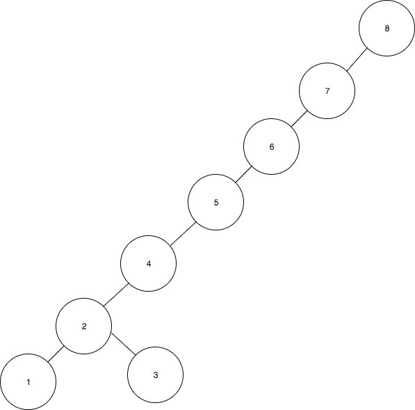

2. Rotate **1** to **2** 

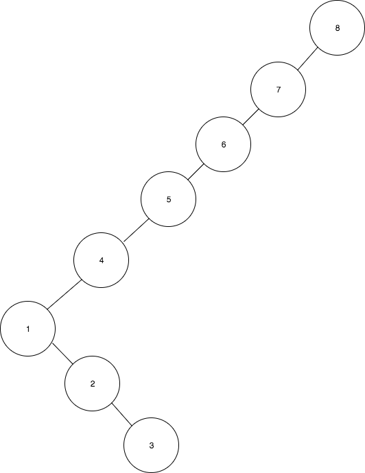

3. Rotate **4** to **5**

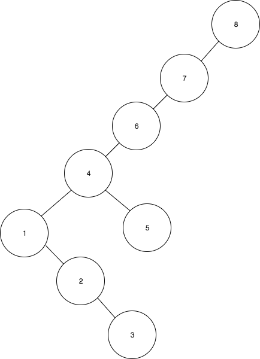

4. Rotate **1** to **4** 

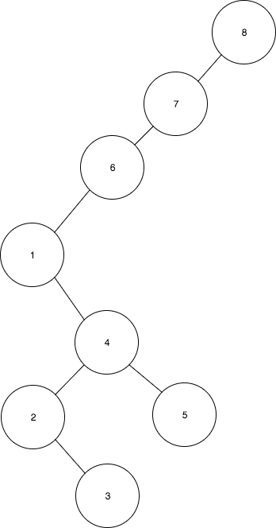

5. Finally after splaying **1** to the root the tree will look like this: 

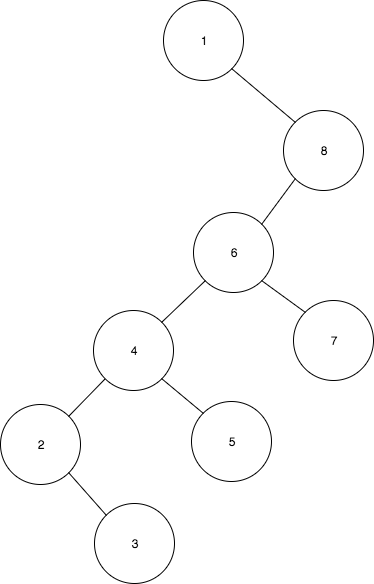


Based on the example above, we can see why it's important to rotate first to the grandparent. We got a tree of height = 6, from an initial tree of height = 8. If the tree would had been taller, we would have achieved almost half of the initial height after the splaying operation.

## ZigZig wrong rotation order 

If the rotations would had been taking first the parent and not the grandparent we would have finished with the following, yet unbalanced tree, just inverting the side of the elements.

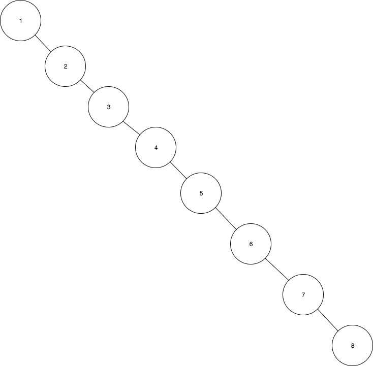


## See also

[Splay Tree on Wikipedia](https://en.wikipedia.org/wiki/Splay_tree)

[Splay Tree by University of California in Berkeley - CS 61B Lecture 34](https://www.youtube.com/watch?v=8Zs1lj_bUV0)


----------------

*Written for Swift Algorithm Club by Barbara Martina Rodeker*

----------------

